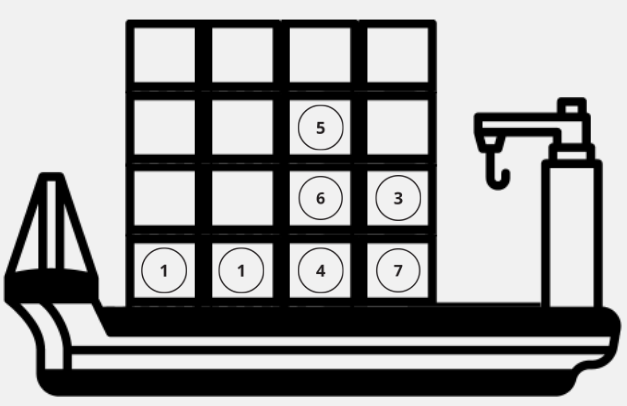

# Agente RL para CPMP with A2C

Trabajo de investigación y desarrollo para Practica I de Ingeniería Civil Informática.

## Introducción

### Agente 
Un agente es un algoritmo que interactúa con un ambiente a traves de acciones, transitando desde un estado actual a uno nuevo recibiendo una recompensas asociada.
El estado corresponde a "la situación actual" del ambiente y entrega toda la información necesaria para que pueda tomar decisiones.

### Ambiente
Para nuestro problema en particular, está ideado para el "Container Pre-marshalling Problem", lo que significa que nuestro ambiente será una serie de pilas con contenedores en ellas.

**Figura 1**: Escenario con 7 containers

### Aprendizaje reforzado

### Deep RL

## Marco teórico
La falta de documentación de esta estrategia, ha motivado la investigación y desarrollo de este proyecto. Se ha investigado la utilización del algoritmo de Greedy para la resolución del CPMP.

### Modelado del agente
Se diseñará un agente que aprenda mediante recompensas, para ello se utilizará
la ecuación de bellman como politica de elección de acciones.

#### Estados
Para modelar los estados se utilizó una lista de pilas (stacks). Por ejemplo, la representación de la **Figura 1** sería

    [[1], [1], [4, 6, 5], [7, 3]]

#### Acciones

#### Recomepensa
 

## Objetivos

## Plan de trabajo

## Programa

## Layout

## Actor Critic
